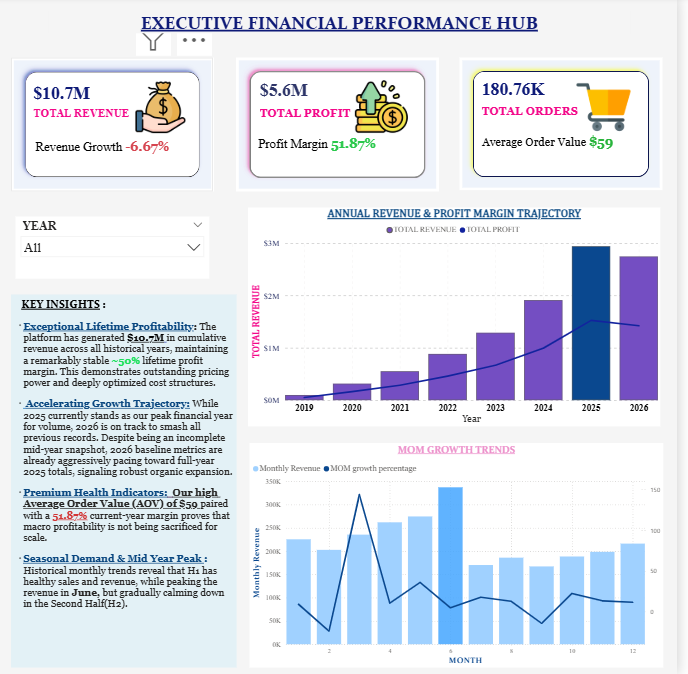
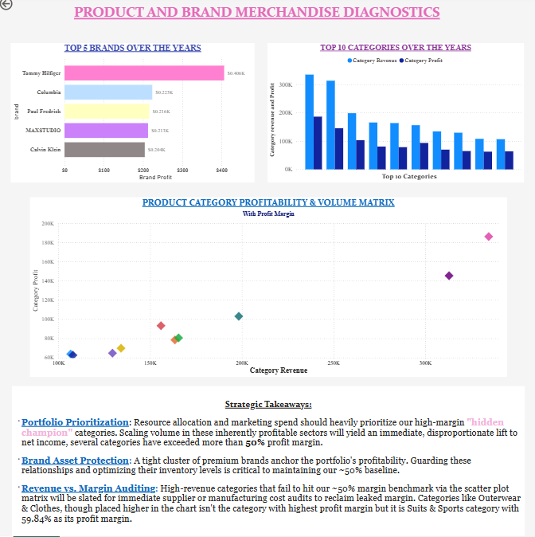
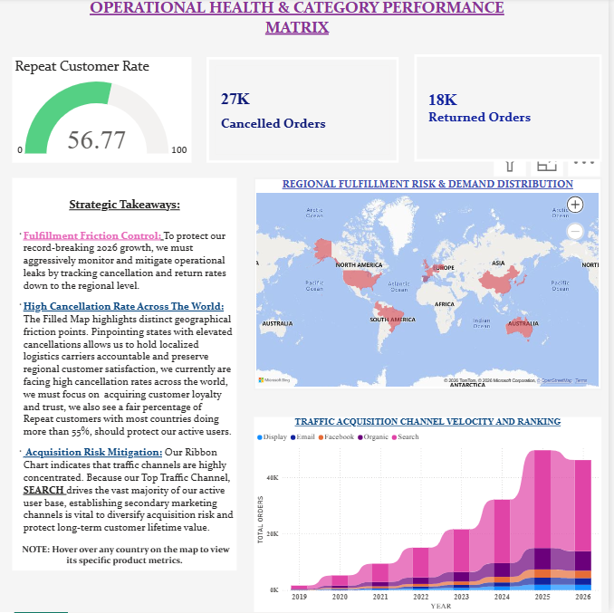

# theLook Ecommerce Analysis

## 📌Project Overview

This project analyzes ecommerce performance using the **theLook Ecommerce** public dataset.

The analysis was built using **Google BigQuery SQL** for data extraction, transformation, metric development, and business analysis, followed by **Power BI** for interactive sales dashboard development.

The goal was to evaluate ecommerce performance across revenue, profitability, products, brands, categories, customers, regions, traffic sources, returns, cancellations, and customer retention.

---

## 🛠️Tools & Technologies

- **Google BigQuery / SQL** — data extraction, transformation, aggregation, and analytical views
- **Power BI** — interactive dashboard development and visualization
- **DAX** — calculated measures and analytical metrics

---

## 🗂️ Data

The analysis uses related tables from the **theLook Ecommerce** public dataset.

The SQL analysis works across four source tables:

- `order_items`
- `products`
- `users`
- `orders`

The tables were combined to connect transaction-level information with product, customer, geographic, and order-history attributes.

## 🧹 Data Preparation & Transformation

A reusable `base_orders` view was created by joining order-item, product, and user information.

The transformation layer included:

- Joining transaction data with product information
- Joining transaction data with customer information
- Extracting order year and month
- Calculating revenue and profit
- Calculating return and cancellation rates
- Creating reusable analytical views for Power BI
- Handling division-by-zero scenarios using `SAFE_DIVIDE`
- Handling missing values where appropriate using `COALESCE`
- Using distinct order and customer counts where the analysis required unique entities

---

## 🔎 SQL Analysis

The SQL analysis was organized into multiple reusable analytical views.

### Financial & Time Analysis

- Yearly revenue and profit
- Monthly revenue and profit
- Month-over-month revenue growth
- Profit margin
- Order volume

### Product & Brand Analysis

- Brand revenue and profitability
- Category revenue and profitability
- Product-level profitability
- Top-performing products
- Lower-margin brands
- Higher-profit brands
- Products with no recorded orders

### Customer & Regional Analysis

- Customers by country and state
- Orders by region
- Repeat customer rate
- Regional cancellation rates
- Regional return rates

### Customer Retention

A cohort-retention analysis was also created by:

1. Identifying each customer's first purchase month
2. Assigning customers to a monthly cohort
3. Tracking subsequent monthly activity
4. Calculating the number of months between cohort and activity

This provided a basis for evaluating customer retention over time and across regions.

---

## 📊 Power BI Dashboard

The Power BI report contains three analytical pages.

### 1. Executive Financial Performance Hub

The first dashboard page focuses on overall ecommerce performance.

This page provides an executive-level view of the financial health and growth of the ecommerce business, showcasing yearly revenue and profit trends and MoM performance growth of the products.



---

This page provides an executive-level view of the financial health and growth of the ecommerce business, showcasing yearly revenue and profit trends and MoM performance growth of the products.


---

### 2. Product & Brand Merchandise Diagnostics

This page focuses on product, brand, and category performance.

The Top 5 Brands analysis highlights:

- Tommy Hilfiger
- Columbia
- Paul Fredrick
- MAXSTUDIO
- Calvin Klein

The purpose of this page is to identify high-performing merchandise, compare profitability across categories, and highlight brands contributing strongly to ecommerce performance. It also identifies the top 10 product categories, along with an overall profit margin analysis, while investigating the gap between revenue and profits across merchandise categories.



---

### 3. Operational Health & Category Performance

The third page focuses mainly on customer acquisition, regional performance, and operational health.

This particular page clearly presents regional customer and order distribution, cancellation and return rates to help better understand which regions across the globe we are doing well in and which areas need our focus, along with traffic acquisition channel performance. It connects customer acquisition and geographic performance with operational indicators such as returns, cancellations, and repeat purchasing behavior.



---

## 💡 Key Findings

The analysis identified several areas for further business investigation.

### Financial Performance

- Revenue and profit performance changes over time, with both yearly trends and month-over-month growth analyzed to identify periods of acceleration or decline.
- Profitability was evaluated alongside revenue rather than relying solely on sales volume, allowing higher-revenue but lower-margin merchandise to be distinguished from more profitable products and brands.

### Brand & Product Performance

- The dashboard identifies a group of leading brands based on profitability, including **Tommy Hilfiger, Columbia, Paul Fredrick, MAXSTUDIO, and Calvin Klein**.
- Product categories were evaluated using both revenue and profit, allowing high-volume categories to be compared against their profitability.
- Product-level analysis was also used to identify highly profitable products and products with no recorded orders.

### Customer & Regional Performance

- Customer activity varies across geographic regions, with regional differences in order volume, customer volume, repeat purchasing, returns, and cancellations.
- Repeat customer rate provides an additional perspective on ecommerce performance beyond acquisition and order volume.
- Regional return and cancellation patterns can help identify areas that may require further operational investigation.

### Traffic & Acquisition

- Traffic acquisition sources were analyzed across years to compare their order volume and relative ranking.
- This allows acquisition channels to be evaluated not only by overall volume but also by how their contribution changes over time.

### Retention

- Cohort analysis was used to track customer activity after the first purchase.
- The resulting retention dataset can be used to compare customer engagement across cohorts and geographic regions.

> These findings describe patterns observed in the dataset and should not be interpreted as proof of causal relationships.

---

## 💡 Business Questions

The analysis was designed to answer questions such as:

1. How is ecommerce revenue and profit changing over time?
2. Which brands and categories contribute most to revenue and profitability?
3. Which products generate the highest profit?
4. Which brands have comparatively lower profit margins?
5. How does order volume vary across regions?
6. Which regions have higher return or cancellation activity?
7. What proportion of customers make repeat purchases?
8. How do traffic acquisition sources perform over time?
9. How does customer activity change after the first purchase?
10. Which areas of the ecommerce business may require further investigation?

---

## 📁 Project Structure

```text
thelook-ecommerce-analysis/
├── README.md
├── sql/
│ └── thelook-ecommerce-analysis.sql
├── powerbi/
│ └── thelook-ecommerce-dashboard.pbix
└── screenshots/
├── executive-financial-performance.png
├── merchandise-diagnostics.png
└── operational-health.png
